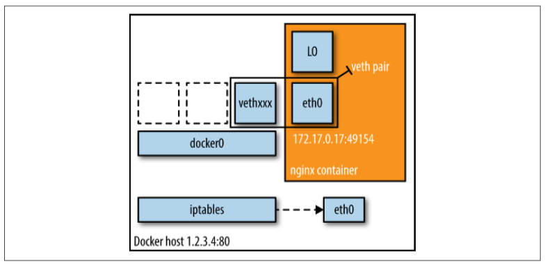
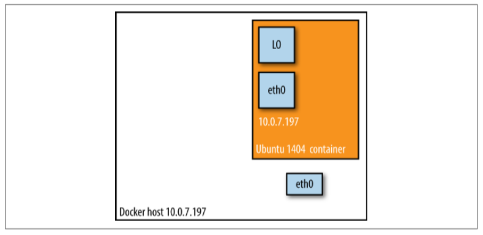

### 第二章 容器网络介绍

------

本章介绍单主机容器网络相关的主题，主要介绍Docker。我们还将讨论管理方面的挑战，例如IP地址管理和安全方面的考虑。在第三章中，我们将讨论多主机场景。

#### 单主机容器网络导读

一个容器需要运行在主机上。可以是一个物理机器，例如私有数据中心的裸机服务，或者在私有云或者公有云上的一个虚拟机。

对于Docker容器，主机上有一个守护进程和一个客户端运行，如图2-1所示，你能够使用Docker与容器镜像中心交互。此外，你可以 *pull/push* 容器镜像，*start,stop,pause,inspect* 容器。值的注意的是现在大多数（或许不是全部）容器都符合[Open Container Initiative(OCI)](https://www.opencontainers.org)，除了Docker还有一些备选的容器软件。可以使用，特别是在Kubernetes环境中。


*Figure 2-1.* 单主机Docker简略架构

主机和容器的对应关系是*1 : N*。这意味着一个典型的主机上运行着数个容器。例如，[Facebook](http://bit.ly/1PfgJFU)的报告称，根据机器的配置情况，在Facebook每个主机平均运行10-40个容器。

无论你是使用单主机部署还是使用集群，你都需要处理网络问题：

+ 对于单主机部署，几乎总是需要连接到同一主机上的其他容器；例如，像WildFly这样的应用服务器可能需要连接数据库。
+ 对于多主机部署，需要考虑两个方面：容器如何在主机内通信，以及不同主机之间的通信路径如何。性能考虑和安全方面都可能影响您的设计决策。多主机部署通常是必要的，无论是当单个主机的容量无法满足您的要求时(出于弹性考虑)，还是当需要使用分布式系统时(如Apache Spark或Apache Kafka)。

> **Distributed Systems and Data Locality**： 使用分布式系统(用于计算或存储)的基本思想是得益于并行处理，通常与数据局部性一起使用。我所说的数据局部性是指将代码发送到数据所在的位置的原则，而不是(传统的)其他方式。
> 考虑一下下面的内容:如果您的数据集大小在TB级别，而代码大小在MB级别，那么在集群中移动代码比将所有数据转移到中心处理位置要更有效。为了能够并行地处理事物，您通常可以通过分布式系统获得容错能力，因为系统的某些部分可以继续或多或少地独立工作。

简单的说，Docker网络是你在使用Docker时，本地化容器SDN解决方案。

#### Docker网络模式

概括的说，Docker有四中单主机网络模式

***Bridge mode***

通常用在应用运行在单节点的Docker的场景下；这是单主机Docker下默认的网络模型。

***Host mode***

同样用在单节点的Docker；移除网络隔离而使用主机网络。

***Container mode***

允许你使用另一个容器使用网络命名空间。用于Kubernetes。

***No networking***

禁用Docker对网络的支持，并允许您设置自定义网络。

现在，我们将仔细研究这些模式中的每一种，并在本章结束时考虑一些管理问题，包括IP/端口管理和安全性。

*译者注*：最新的Docker网络模式参考[Docker Networking](https://docs.docker.com/network/)。

#### Bridge Mode Networking

在这种模式下(参见图2-2)，Docker守护进程创建docker0，这是一个虚拟网桥，它可以在连接到它的任何其他网络接口之间自动转发数据包。默认情况下,通过创建一对接口（veth pair）这个守护进程将主机上的所有容器连接到内部网络,分配一个成为容器eth0接口,并将另一个分配给主机上的网络命名空间,同时从私有IP子网范围中分配一个IP地址给这个网络。下面是一个使用桥接模式的例子:

```shell
$ docker run -d -P --net=bridge nginx:1.9.1
$ docker ps
CONTAINER ID   IMAGE                  COMMAND    CREATED
STATUS         PORTS                  NAMES
17d447b7425d   nginx:1.9.1            nginx -g   19 seconds ago
Up 18 seconds  0.0.0.0:49153->443/tcp,
               0.0.0.0:49154->80/tcp  trusting_feynman
```

> **NOTE:**因为桥接模式是默认设置，你可以使用`docker run -d -P nginx:1.9.1`替换前面的命令。如果您不使用 `	-P`参数，它将发布容器的所有公开端口，或者`-p <host_port>:<container_port>`，它将发布定义的端口，IP数据包将不能被路由到主机外部的容器。



*Figure 2-2.* 桥式网络

#### Host Mode Networking

这种模式有效地禁用Docker容器的网络隔离。由于容器共享主机的网络名称空间，如果主机网络没有防火墙，它可能直接公开给公共网络。作为共享名称空间的一个参数，您需要以某种方式管理端口分配。下面是一个运行中的主机模式联网的例子:

```shell
$ docker run -d --net=host ubuntu:14.04 tail -f /dev/null
$ ip addr | grep -A 2 eth0:
2: eth0: <BROADCAST,MULTICAST,UP,LOWER_UP> mtu 9001 qdisc mq state UP group
default qlen 1000
    link/ether 06:58:2b:07:d5:f3 brd ff:ff:ff:ff:ff:ff
    inet **10.0.7.197**/22 brd 10.0.7.255 scope global dynamic eth0
$ docker ps
CONTAINER ID  IMAGE         COMMAND  CREATED
STATUS        PORTS         NAMES
b44d7d5d3903  ubuntu:14.04  tail -f  2 seconds ago
Up 2 seconds                jovial_blackwell
$ docker exec -it b44d7d5d3903 ip addr
2: eth0: <BROADCAST,MULTICAST,UP,LOWER_UP> mtu 9001 qdisc mq state UP group
default qlen 1000
    link/ether 06:58:2b:07:d5:f3 brd ff:ff:ff:ff:ff:ff
    inet **10.0.7.197**/22 brd 10.0.7.255 scope global dynamic eth0
```

这里有it: 容器的IP地址与主机相同，即10.0.7.197。

在 *图2-3* 中我们看到，当使用主机模式网络时，容器高效地从主机继承IP地址。这种模式比桥接模式更快，因为它没有路由开销，但是它将容器直接暴露给公共网络，并涉及到所有安全问题。



*Figure 2-3.*  Docker主机网络

#### Container Mode Networking

在这种网络模式下，你告诉Docker重用另一个容器的网络命名空间。通常，如果您希望对网络堆栈进行细粒度控制 and/or 控制其生命周期，那么这种模式非常有用。事实上，Kubernetes使用这种网络模式，你可以在第7章了解更多。以下是实际的操作：

```shell
$ docker run -d -P --net=bridge nginx:1.9.1
$ docker ps
CONTAINER ID  IMAGE        COMMAND   CREATED         STATUS
PORTS                      NAMES
eb19088be8a0  nginx:1.9.1  nginx -g  3 minutes ago   Up 3 minutes
0.0.0.0:32769->80/tcp,
0.0.0.0:32768->443/tcp     admiring_engelbart
$ docker exec -it admiring_engelbart ip addr
8: eth0@if9: <BROADCAST,MULTICAST,UP,LOWER_UP> mtu 9001 qdisc noqueue state
UP group default
    link/ether 02:42:ac:11:00:03 brd ff:ff:ff:ff:ff:ff
    inet **172.17.0.3**/16 scope global eth0
$ docker run -it --net=container:admiring_engelbart ubuntu:14.04 ip addr
...
8: eth0@if9: <BROADCAST,MULTICAST,UP,LOWER_UP> mtu 9001 qdisc noqueue state
UP group default
    link/ether 02:42:ac:11:00:03 brd ff:ff:ff:ff:ff:ff
    inet **172.17.0.3**/16 scope global eth0

```

在这个示例中显示的结果是我们所期望的:第二个容器以--net=container开头加上的第一个容器自动指定的容器名admiring_engelbart启动，具有与第一个容器相同的IP地址(即172.17.0.3)。

#### No Networking

这种模式将容器放在自有的网络命名空间中，而且不配置它。这有效地关闭了网络，并且在两种情况下是有用的:对于不需要网络的客户端，例如写入磁盘卷的批作业，或者您想要建立自定义网络(关于利用这一点的许多选项，请参阅第3章)。这里有一个例子:

```shell
$ docker run -d -P --net=none nginx:1.9.1
$ docker ps
CONTAINER ID  IMAGE         COMMAND   CREATED
STATUS        PORTS         NAMES
d8c26d68037c  nginx:1.9.1   nginx -g  2 minutes ago
Up 2 minutes                grave_perlman
$  docker inspect d8c26d68037c | grep IPAddress
"IPAddress": "",
"SecondaryIPAddresses": null,
```

正如这个示例所示，没有配置任何网络，正如我们所期望的那样。

您可以通过[Docker文档](https://docs.docker.com/network/)了解更多关于网络和配置选项的信息。

#### 网络管理的一些建议

我们现在将从管理的角度简要讨论您应该注意的其他方面。这些问题中的大多数都与多主机部署有一定关系:

***IP地址分配***

当容器频繁的创建删除或者容器数量有一定规模后，手动分配IP地址是不靠谱的。*bridge mode*在一定程度上解决了这个问题。为了防止本地网络上的ARP冲突，Docker守护进程使用分配的IP地址生成一个MAC地址。

***端口管理***

管理端口有两种方法:固定端口分配或动态端口分配。分配单位可以是service(或application)，也可以是全局策略。对于*bridge mode*，Docker可以自动分配(UDP或TCP)端口，从而使其可路由。像Kubernetes这样横切面编排系统和*IP-per-container networking model*不会受到这个问题的影响。

***网络安全***

在开箱即用中，Docker启用了跨容器通信(默认配置为`--ice=true`)。这意味着主机上的容器可以不受任何限制地相互连接，这可能导致拒绝服务攻击。此外，Docker通过`--ip_forward`和`--iptables`选项控制容器和容器外部的通信。作为一个好的实践，您应该参照公司安全策略研究这些选项的默认值，并且如何在Docker守护进程设置中反映它们。
像使用OCI的容器运行时接口(CRI - o)这样的系统，提供了没有Docker这样的大型守护程序的可选运行时，并且可能会暴露更小的攻击面。
另一个网络安全方面是在线加密，这通常意味着RFC 5246中的TLS/SSL。

#### 总结

在本章中，我们讨论了四种基本的单主机网络模式和相关的管理问题。现在您对单主机的情况有了基本的了解，让我们来看一个可能更有趣的情况:多主机容器网络。
