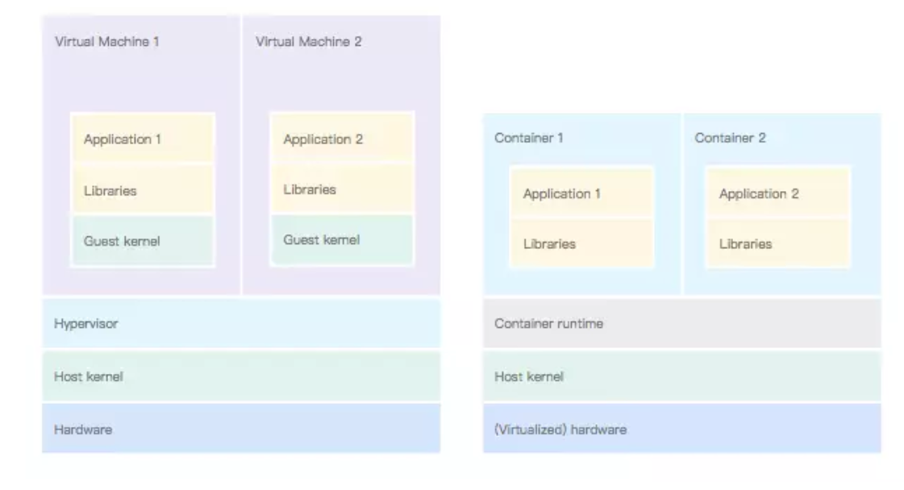

容器提供隔离：使用默认设置，Docker 容器内的进程无法访问来自主机或其他并置容器的信息。但是，由于容器共享主机的内核，因此隔离不像虚拟机那样完整。攻击者可以找到未知的漏洞（在 Docker 或 Linux 内核本身中），这些漏洞将允许攻击者从容器中逃脱。如果攻击者确实发现了漏洞并且你的进程在容器内以 root 身份运行，则他们将获得对主机的 root 访问权限。



图 6. 左侧，虚拟机使用虚拟化硬件。右侧，容器中的应用程序使用主机内核。

为避免这种可能性，最佳做法是不在容器内以 root 身份运行进程。你可以使用 PodSecurityPolicy 在 Kubernetes 中强制执行此行为 。在 Kubernetes 中创建 pod 时，使用 runAsUser 选项 指定正在运行该进程的 Linux 用户。这种方法会覆盖 Dockerfile 中的 USER 指令。

实际上，存在挑战。许多软件包都以 root 身份运行其主进程。如果要避免以 root 用户身份运行，设计你的容器使用未知的非特权用户运行。这种做法通常意味着你必须调整各种文件夹的权限。在容器中，如果按照一个容器一个应用的最佳实践，并且一个应用一个用户（最好不是 root 用户），则授予所有用户对文件夹和文件的读写权限不是问题 。

检查容器是否符合此最佳实践的一种简单方法是在本地使用随机用户运行容器并测试是否正常工作。替换 [YOUR_CONTAINER] 为你的容器名称。

```
docker run --user $（（RANDOM + 1））[YOUR_CONTAINER]
```

如果容器需要外部卷，则可以配置 fsGroup Kubernetes 选项 以将此卷的所有权授予给特定的 Linux 组。此配置解决了外部文件所有权的问题。

如果你的进程由非特权用户运行，则它将无法绑定到 1024 以下的端口。这不是什么大问题，因为你可以配置 Kubernetes 服务将流量从一个端口路由到另一个端口。例如，你可以配置 HTTP 服务器绑定到 8080 端口，并通过 Kubernetes 服务从 80 端口将流量重定向回来。

demo : https://github.com/sudo-bmitch/jenkins-docker/blob/master/Dockerfile

The entrypoint.sh looks up the gid of the /var/lib/docker.sock file and updates the gid of the docker user inside the container to match. This allows the image to be ported to other docker hosts where the gid on the host may differ. Changing the group requires root access inside the container. Had I used `USER jenkins` in the dockerfile, I would be stuck with the gid of the docker group as defined in the image which wouldn't work if it doesn't match that of the docker host it's running on. But root access can be dropped when running the app which is where gosu comes in.

At the end of the script, the exec call prevents the shell from forking gosu, and instead it replaces pid 1 with that process. Gosu in turn does the same, switching the uid and then exec'ing the jenkins process so that it takes over as pid 1. This allows signals to be handled correctly which would otherwise be ignored by a shell as pid 1.